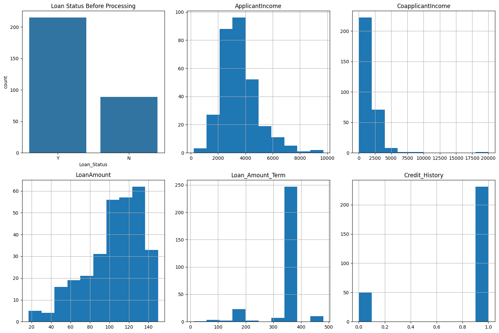
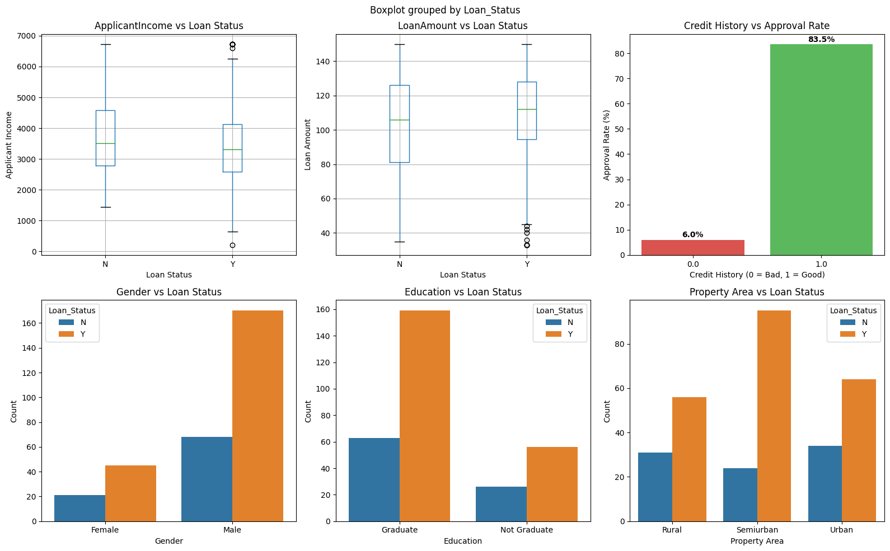
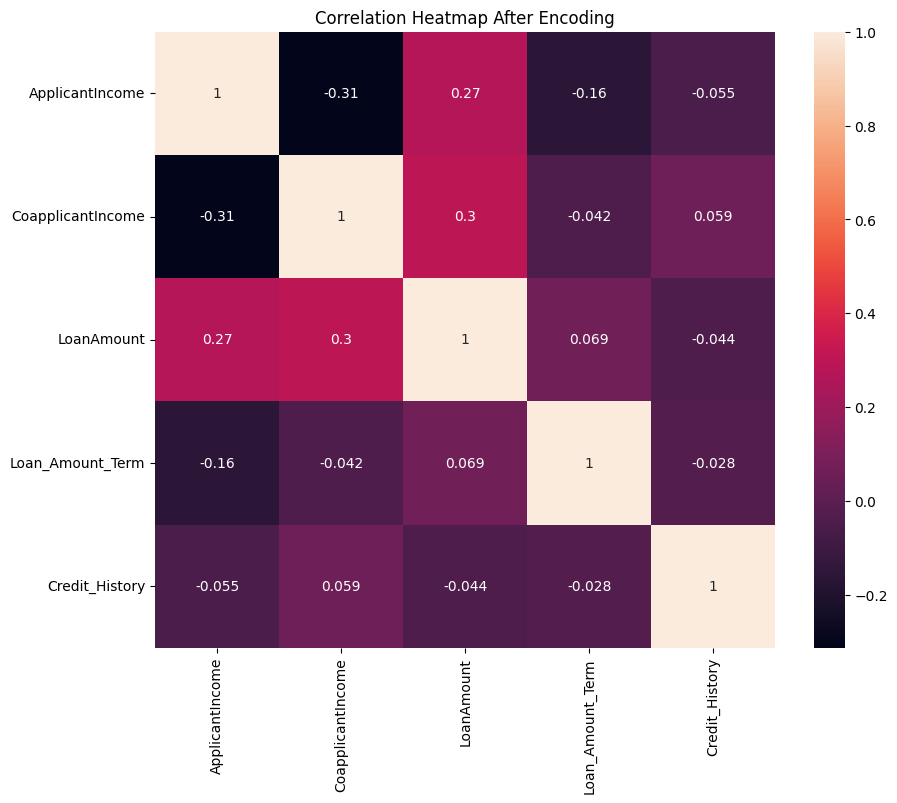
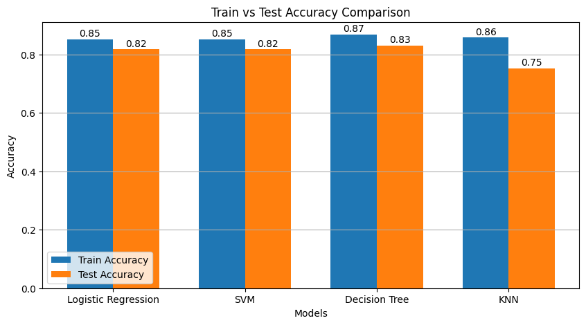

<div align="center">

# 🏦 Loan Status Prediction

**A machine learning pipeline that predicts whether a loan application will be approved**


<br/>


</div>

---

## 📌 Overview

This project builds and compares several classification models that predict `Loan_Status` (approved **Y** / rejected **N**) from applicant information such as income, credit history, education and property area.

The work covers the full workflow: data cleaning, outlier handling, exploratory visualization, encoding, feature selection, scaling, hyperparameter tuning with cross-validation, and a final side-by-side model comparison.

---

## 📂 Dataset

| File | Purpose |
|:--|:--|
| `train_data.csv` | Training data (includes `Loan_Status`) |
| `test_data.csv` | Test data (includes `Loan_Status`, used for evaluation) |

**Features:** `Gender`, `Married`, `Dependents`, `Education`, `Self_Employed`, `ApplicantIncome`, `CoapplicantIncome`, `LoanAmount`, `Loan_Amount_Term`, `Credit_History`, `Property_Area`

**Target:** `Loan_Status` (`Y` = 1, `N` = 0)

<!-- Add the dataset source / link here -->

---

## ⚙️ Pipeline

1. **Loading & inspection** — read the train and test CSVs and check types and missing values.
2. **Visualization (before preprocessing)** — loan status distribution and histograms of numeric columns.
3. **Cleaning**
   - Dropped `Loan_ID` and duplicate rows.
   - Replaced `3+` dependents with `3`.
   - Filled missing categorical values and `Credit_History` / `Loan_Amount_Term` with the **mode**, and `LoanAmount` with the **median**.
4. **Outlier handling** — capped `ApplicantIncome`, `CoapplicantIncome` and `LoanAmount` using the **IQR rule** (1.5 × IQR).
5. **Exploratory analysis** — boxplots, approval rate by credit history, and approval counts by gender, education and property area.
6. **Encoding** — one-hot encoding (`drop_first=True`) for all categorical features.
7. **Feature selection** — kept features whose absolute correlation with `Loan_Status` is above **0.05**.
8. **Scaling** — `MinMaxScaler` for Logistic Regression and SVM, `StandardScaler` for KNN. The Decision Tree uses unscaled features.
9. **Modeling** — each model is tuned with `GridSearchCV` (5-fold CV, accuracy scoring).
10. **Evaluation** — train/test accuracy, precision, recall, F1-score and a confusion matrix per model, plus a final train vs test accuracy chart.

---

## 🔎 Key Findings



- **Credit history is the strongest signal:** applicants with a good credit history were approved at a far higher rate (over 80%) than those without (about 6%).
- Applicants who are graduates and those in **Urban / Semiurban** areas had more approvals.
- Higher applicant income slightly improved approval chances, while very large loan amounts sometimes led to rejection.
- Income and loan amount contained outliers, which were capped with the IQR rule.

<div align="center">

<br/>

</div>

---

## 🤖 Models & Tuning

| Model | Hyperparameters searched |
|:--|:--|
| **Logistic Regression** | `C` ∈ {0.01, 0.1, 1, 10}, `solver` ∈ {liblinear, lbfgs} |
| **SVM** | `C` ∈ {0.1, 1, 10}, `kernel` ∈ {linear, rbf} |
| **Decision Tree** | `max_depth` ∈ {3, 5, 7, None}, `criterion` ∈ {gini, entropy} |
| **KNN** *(bonus)* | `n_neighbors` ∈ {3, 5, …, 29}, `p` ∈ {1, 2}, stratified 5-fold CV |

---

## 📈 Results

| Model | Train Accuracy | Test Accuracy |
|:--|:--:|:--:|
| Logistic Regression | 0.85 | 0.82 |
| SVM | 0.85 | 0.82 |
| **Decision Tree** | 0.87 | **0.83** |
| KNN | 0.86 | 0.75 |



The Decision Tree scored best on the test set, with Logistic Regression and SVM close behind. KNN showed the largest gap between train and test accuracy, which points to overfitting. Precision, recall, F1-score and confusion matrices for each model are printed by the script.

---

## 🚀 How to Run

```bash
# 1. Clone the repo
git clone https://github.com/OmarMahmoud-m/loanStatusPrediction.git
cd loanStatusPrediction

# 2. Install dependencies
pip install numpy pandas matplotlib seaborn scikit-learn

# 3. Place train_data.csv and test_data.csv in the project folder
#    and update the file paths at the top of the script, then run it
python main.py
```

> The script currently reads the CSVs from absolute local paths. Change them to relative paths (e.g. `pd.read_csv("train_data.csv")`) so anyone can run it.

---

## 🔍 Limitations & Future Work

- **Preprocessing consistency:** missing values in the test set are filled using the test set's own mode/median, and outlier capping is applied to the training set only. Fitting these statistics on the training data and reusing them on the test data would be more rigorous.
- **Feature selection:** correlation with the target only captures linear relationships. Tree-based importance or recursive feature elimination could be compared.
- **Encoding alignment:** one-hot encoding is applied to train and test separately, which can produce mismatched columns. A shared encoder or `reindex` after encoding is safer.
- **Class imbalance:** consider checking class balance and trying `class_weight="balanced"`, or comparing models with ROC-AUC alongside accuracy.
- **More models:** Random Forest or Gradient Boosting could be added for comparison.

---

<div align="center">
<sub>Built as a university artificial intelligence  project.</sub>
</div>
